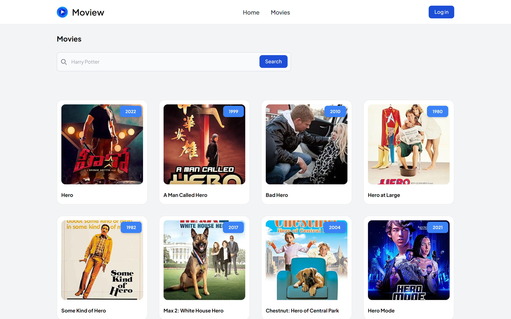

# Movie Search

## Description
The Moview Movie Search is a web application built with Angular that allows users to search for movies. This application fetches movie data from an API and displays it in a user-friendly interface. Users can search for movies, navigate through the search results, and save their favorite movies to local storage for later viewing.

## Tech Stack
- **Angular**: Framework for building the application
- **TypeScript**: Programming language used for development
- **Tailwind CSS**: Utility-first CSS framework for styling
- **RxJS**: Library for reactive programming using observables
- **Jasmine & Karma**: Testing frameworks
- **Node.js & npm**: Environment and package manager

## Installation Guide
1. **Clone the repository**
   ```sh
   git clone https://github.com/uuqkun/movie-search.git
   cd movie-search
   ```

2. **Install dependencies**
   ```sh
   npm install
   ```

3. **Start the development server**
   ```sh
   npm run start
   ```

4. **Run tests**
   ```sh
   ng test
   ```

**Note**: Install angular CLI globally if don't have any

- **Run installation**
   ```sh
   npm install -g @angular/cli
   ```

## Screenshots
<!-- Add screenshots of your application here -->
### **Mobile View**


### **Desktop View**



## Project Approach
Untuk menyelesaikan proyek ini, saya mengikuti pendekatan terstruktur yang melibatkan beberapa langkah analitis dan implementatif. Berikut adalah langkah-langkah yang saya ambil:

1. **Analisis Draft Technical Test:**
   - Langkah pertama adalah membaca dan memahami draft technical test secara menyeluruh. Saya menganalisis setiap ketentuan dan persyaratan yang diberikan, termasuk tipe submission yang diharapkan. Ini membantu saya mendapatkan gambaran yang jelas tentang tujuan proyek dan apa yang perlu dicapai.

2. **Inisialisasi Proyek Angular dengan npm:**
   - Setelah memahami persyaratan, saya mempelajari cara menginisialisasi proyek Angular menggunakan npm. Saya memastikan bahwa semua dependensi dan konfigurasi dasar telah diatur dengan benar untuk memulai pengembangan proyek.

3. **Belajar Routing dan Setup Routing:**
   - Saya mempelajari konsep routing di Angular dan mengatur routing yang diperlukan untuk memenuhi persyaratan tes. Ini termasuk rute untuk halaman `/movies` dan `/movies/:id` yang memungkinkan navigasi di dalam aplikasi.

4. **Setup Shared Component:**
   - Untuk memastikan konsistensi UI di seluruh aplikasi, saya mempelajari dan mencoba mengatur komponen shared seperti navbar dan footer. Komponen ini digunakan di berbagai halaman aplikasi untuk menyediakan navigasi dan informasi yang konsisten.

5. **Pembangunan UI dan Pengaturan Tailwind CSS:**
   - Saya mulai membangun antarmuka pengguna (UI) dengan mengatur font global dan kelas container responsif di file konfigurasi Tailwind CSS. Langkah ini penting untuk memastikan tampilan yang konsisten dan responsif di seluruh halaman aplikasi.

6. **Implementasi Testing dengan Karma dan Jasmine:**
   - Setelah semua persyaratan utama terpenuhi, saya mempelajari dan mengimplementasikan alat pengujian Karma dan Jasmine. Pengujian ini membantu memastikan bahwa fungsionalitas aplikasi bekerja sesuai yang diharapkan.

7. **Pengujian Langsung UI dan Fungsionalitas:**
   - Saya melakukan pengujian langsung terhadap antarmuka pengguna dan fungsionalitas aplikasi. Ini termasuk memeriksa setiap halaman dan fitur untuk memastikan tidak ada bug atau masalah yang terlewatkan.

8. **Penyusunan Dokumentasi:**
   - Untuk memastikan bahwa proyek ini mudah dimengerti dan dapat dikelola oleh orang lain, saya menyusun dokumentasi lengkap dalam file markdown. Dokumentasi ini mencakup langkah-langkah instalasi, penggunaan, dan informasi teknis lainnya.

9. **Debugging dan Pembelajaran Konsep Baru:**
   - Selama pembangunan proyek, saya melakukan debugging secara rutin untuk mengatasi masalah yang muncul. Saya juga memanfaatkan kesempatan ini untuk mempelajari konsep-konsep baru di Angular yang membantu saya meningkatkan kualitas dan efisiensi pengembangan aplikasi.

Dengan pendekatan ini, saya dapat menyelesaikan proyek dengan cara yang terorganisir dan efisien, memastikan bahwa setiap persyaratan terpenuhi dan aplikasi berfungsi dengan baik.